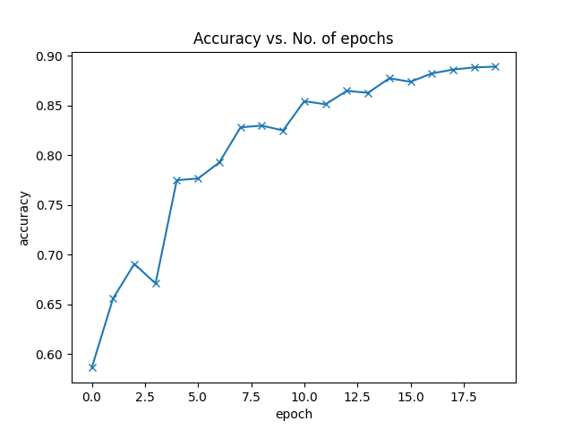

# Ablating study of the placement of the dropout layers in relation to the batch norm (BN) Layers

Understanding the Disharmony between Dropout and Batch Normalization by
Variance Shift by li et al, descibes the disharmony between BN and dropout they call this disharmony "variance shift". they test two configurations of BN and Dropout. 

1. with the dropout layers before right before the final batch norm of the bottlenecks for each block. They only have dropout layers right before the batch layers.
2. Dropout placed before the last convolutional layer before the bottleneck in every block. 

First iteration: [baseline](artifacts/baseline_CNN_20260620_195048)

For each block, the 2D dropout layers were placed as the final component of the bottleneck right before feeding into the next block. There were also two 1D dropout layers before the final two linear layers before the softmax prediction layer. These two were removed as they degraded performance instead of improved.

For the first configuration, the final accuracy improved by 0.013. 

Between configuaration 1 and 2, there is no clear difference between the two although configuration 2 has a smoother training curve. 

### Dropout p values in the conv blocks only. Batch 256

- 0.05: accuracy of 0.8789 ([p=0.05](artifacts/MCDropout_CNN_20260620_214429))
- 0.10: accuracy of 0.8785 ([p=0.1](artifacts/MCDropout_CNN_20260620_213712))
- 0.15: accuracy of 0.8737 ([p=0.15](artifacts/MCDropout_CNN_20260620_214441))
- 0.30: accuracy of 0.8357 ([p=0.3](artifacts/MCDropout_CNN_20260620_213727))

### Dropout p values in the FC head only. Batch 256

Removing the dropout layers from the convolutional blocks and only keep it before the linear layers in the prediction head results in considerably better performance.

Accuracy results:
- 0.00: 0.8813 ([p=0.00](artifacts/MCDropout_CNN_20260620_220122))
- 0.05: 0.8868 ([p=0.05](artifacts/MCDropout_CNN_20260620_220221))
- 0.10: 0.8836 ([p=0.10](artifacts/MCDropout_CNN_20260620_220229))
- 0.15: 0.8865 ([p=0.15](artifacts/MCDropout_CNN_20260620_220332))
- 0.20: 0.8824 ([p=0.20](artifacts/MCDropout_CNN_20260620_214643))

Marginal better effect.

#### Batch 128

Accuracy results:
- 0.00: 0.8943 ([text](artifacts/MCDropout_CNN_20260620_223614))
- 0.05: 0.8855 ([text](artifacts/MCDropout_CNN_20260620_223937))
- 0.10: 0.8893 ([text](artifacts/MCDropout_CNN_20260620_223942))
- 0.15: 0.8785 ([text](artifacts/MCDropout_CNN_20260620_223952))
- 0.20: 0.8813 ([text](artifacts/MCDropout_CNN_20260620_223957))

#### Batch 64

Accuracy results:
- 0.00: 0.8985 [text](artifacts/MCDropout_CNN_20260620_224144)
- 0.05: 
- 0.10: 
- 0.15: 
- 0.20: 

##### Reliability plots from [text](artifacts/MCDropout_CNN_20260620_223614)

# Deterministic and stochastic model predictions. 

For the baseline model, we have determanistic predictions -- a softmax over the classes -- and for the evaluation model we employ stochastic predictions through MC dropout -- multiple forward passes with the dropout layers active, results are returned as mean and variance over the classes. 

Commit ID: b5e2537b6fdcdf5858586e6bf504acd0d10a8993
```bash
uv run python main.py --train --dropout_p 0.1 --epochs 20
```

Traing a model with p=0.1 dropout for 20 epochs heeds a final accuracy of 88.93\%. 


The Expected Calibration Error (ECE) for the baseline model (no MC-dropout at inference) is 0.0376 meaning the model is slightly overconfident and for MC-dropout active at 30 samples gives an ECE of 0.0319. An improvement of 0.0057 ECE points, corresponding to a relative reduction of approximately 15.2% compared to the baseline. This indicates that enabling MC-dropout at inference improves calibration slightly, making the model’s predicted confidence better aligned with its actual accuracy.


